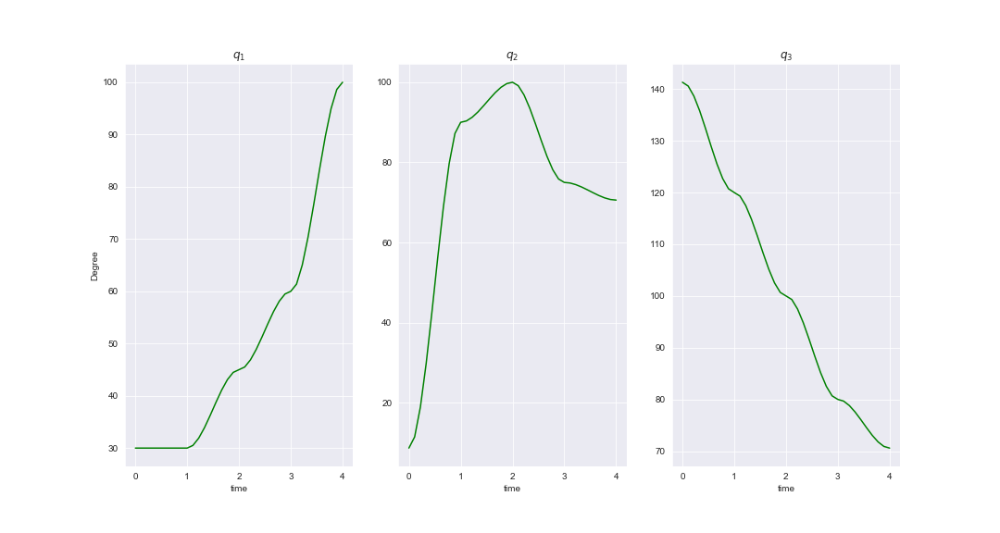

# Robotics_course

### for imishani use only

## Exercise 04
### In order to see the implementaion of Task 4 click on the file:
[imishani ex.04](https://github.com/imishani/Robotics_course/blob/master/ex04.ipynb) 
#### Question 1:
gif of Q free:

#### Question 2:
##### 2) b

##### 2) c

###### using PRM:

#### Question 3:
##### implementation a:

##### implementation b:

## Exercise 05
---------------
### In order to see the implementaion of Task 4 click on the file:
[imishani ex.05](https://github.com/imishani/Robotics_course/blob/master/ex05.ipynb)

##### question 3:

##### question 4:

