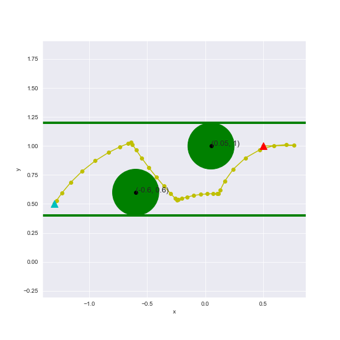

# Robotics_course

### for imishani use only

In order to see the implementaion of Task 4 click on the file:
#### ex04

#### Question 1:
gif of Q free:

#### Question 2:
##### 2) b

##### 2) c

#### Question 3:
##### implementation a:

##### implementation b:

